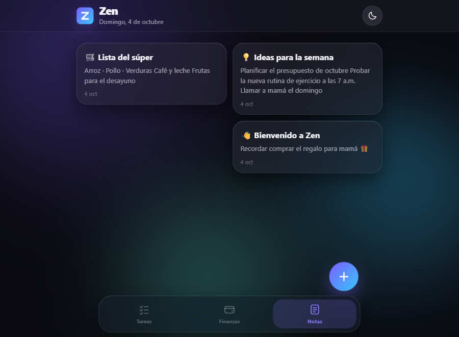
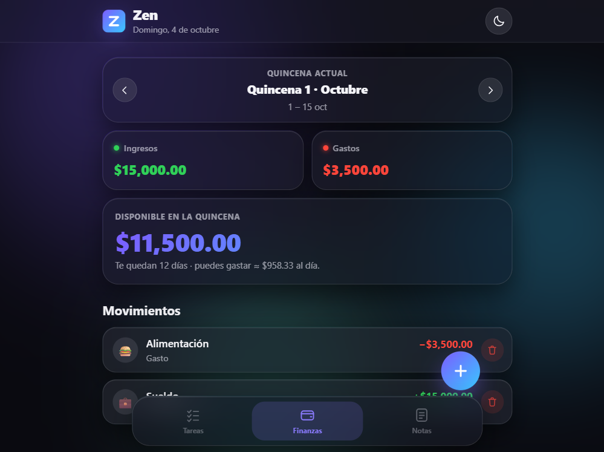
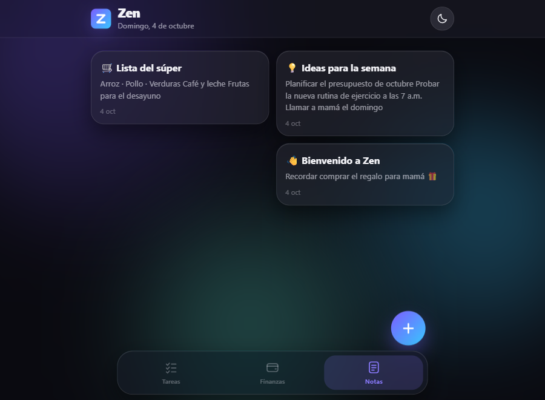

# 🌿 Zen

**Tu día, en calma.**

Tareas, finanzas por quincena y notas — en una sola app con el estilo de iOS,
modo claro y modo oscuro, y sin depender de internet.

[**▶ Probar Zen en línea**](https://TU-USUARIO.github.io/zen/) ·
[**⬇️ Descargar el código**](#️-descargar)

---

## ✨ ¿Qué hace Zen?

### ✅ Tareas diarias
Escribe lo que tienes que hacer y **márcalo con un toque** cuando lo termines.
Una barra de progreso te muestra cómo va el día, con filtros de
*Pendientes* y *Completadas*. Si te equivocas, todo se puede **deshacer**.

### 💰 Finanzas por quincena
Registra tus **ingresos** y tus **gastos** con categoría y fecha, y Zen calcula
al instante **con cuánto dinero cuentas cada quincena**. Además te dice cuánto
puedes gastar al día para llegar bien a fin de quincena. Puedes navegar por
quincenas pasadas para revisar tu historial.

> *«Te quedan 12 días · puedes gastar ≈ $958.33 al día»* — así se ve la pista diaria.

### 📝 Notas rápidas
Un lugar para tus pensamientos, ideas, listas y recordatorios que quieras
tener a la mano. Se guardan solos mientras escribes, en una cuadrícula tipo
iOS que se acomoda sola.

### 🌗 Modo claro y modo oscuro
Interfaz blanca y luminosa de día, tranquila y oscura de noche. Zen recuerda
tu elección (y si no eliges, sigue la configuración de tu teléfono).

### 📴 Funciona sin internet
Zen se instala como una **aplicación real** en tu teléfono: se abre a pantalla
completa desde tu pantalla de inicio, sin barra de navegador, y todo funciona
**sin conexión** desde el primer momento.

---

## 📸 Capturas

| Modo claro · Tareas |
|:---:|
|  |

| Modo oscuro · Finanzas |
|:---:|
|  |

| Modo oscuro · Notas |
|:---:|
|  |

---

## 📲 Instálala en tu iPhone

Zen no está en la App Store: se instala directamente desde Safari en 30 segundos.

1. Abre el enlace de **[Probar Zen en línea](https://TU-USUARIO.github.io/zen/)** en **Safari**.
2. Toca el botón de **Compartir** (el cuadrado con la flecha ▲).
3. Elige **«Agregar a pantalla de inicio»** → ponle el nombre que quieras → **Añadir**.

<b>En Android y en la computadora</b>

- **Android (Chrome):** menú ⋮ → *«Instalar aplicación»* o *«Añadir a pantalla de inicio»*.
- **Computadora (Chrome / Edge):** icono de instalar 🔨 junto a la barra de direcciones.
- O simplemente **guardarla como favorito** y usarla en el navegador.

---

## ⬇️ Descargar

- **En línea:** [https://TU-USUARIO.github.io/zen/](https://TU-USUARIO.github.io/zen/)
- **El código:** botón verde **Code → Download ZIP**, descomprime y abre `index.html`
  con doble clic. ¡No necesita instalación ni compilar nada!

---

## 🔒 Tus datos son tuyos

Zen **no tiene servidores, cuentas ni rastreadores**. Todo lo que escribes —
tareas, finanzas y notas — se guarda **en el almacenamiento de tu propio dispositivo**.
Nada viaja por internet.

> ⚠️ Si borras los datos del sitio en tu navegador, se borran también las notas:
> copia antes lo que quieras conservar.

---

## ❓ Preguntas frecuentes

| Pregunta | Respuesta |
|---|---|
| ¿Cuesta algo? | No, Zen es gratis y de código abierto. |
| ¿Necesito crear una cuenta? | Nunca. Abres y empiezas a usarla. |
| ¿Funciona en Android? | Sí, en cualquier teléfono o computadora. |
| ¿Y si no tengo internet? | Todo sigue funcionando: las apps instaladas guardan Zen en tu equipo. |
| ¿Puedo cambiar la moneda o los colores? | Sí, es HTML/CSS/JS puro: [mira abajo](#-para-modificarla). |

---

## 🛠️ Para modificarla

No usa frameworks ni dependencias: solo `index.html`, `assets/css/styles.css`
y `assets/js/app.js`. Clona o descarga el código, edita y recarga.

- **Moneda:** en `app.js`, cambia `'$'` dentro de la función `money()`.
- **Categorías:** arreglos `EXPENSE_CATS` e `INCOME_CATS` en `app.js`.
- **Colores:** variables en `styles.css` (`:root` = claro, `[data-theme="dark"]` = oscuro).

Más detalles en la [guía de desarrollo](DESARROLLO.md).

---

## Licencia

Distribuido bajo la licencia [MIT](LICENSE). Úsala, modifícala y compártela. 💜

Hecho con HTML, CSS y JavaScript puros · <b>Zen</b> 🌿

